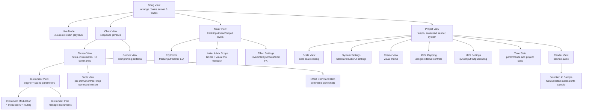

# Dirtywave M8 Workflow Map for RG Nano Parity

This is the product map for turning the RG Nano fork into a tiny, power-user production workstation with M8-like capability. It is not a clone spec. It is a screen/workflow reference so we can decide which ideas belong on a 240x240 RG Nano display, which ideas need a compressed equivalent, and which ideas should stay out.

For the current build-status checklist, use [RGNANO_M8_SCREEN_CAPABILITY_AUDIT.md](RGNANO_M8_SCREEN_CAPABILITY_AUDIT.md). That file is the canonical "what exists, what is partial, what is missing, what to build next" note.

## Source References

Primary source:

- Dirtywave official support page: https://dirtywave.com/pages/resources-downloads
- Dirtywave M8 operation manual, Version 6.5.2, 2026-04-21: https://cdn.shopify.com/s/files/1/0455/0485/6229/files/m8_operation_manual_v20260421.pdf?v=1776791699

Supporting sources:

- Dirtywave product/spec overview: https://dirtywave.com/
- Sound On Sound Model:02 review and workflow explanation: https://www.soundonsound.com/reviews/dirtywave-m8-model02
- Community shortcut reference: https://enqack.net/docs/dirtywave-m8/shortcuts/
- M8 global shortcuts and tips: https://sites.google.com/view/m8tracker/global

The official manual is the visual reference for what each M8 screen looks like. Do not copy manual screenshots into this public repo; link to the manual and cite the page/section instead.

## M8 Core Model

The M8 is built around:

- 8 monophonic tracks.
- Song rows that trigger chains per track.
- Chains that trigger ordered phrases.
- Phrases that contain notes, velocities, instrument numbers, and FX commands.
- Up to 128 instruments per song.
- Instruments that can be synths, samples, external MIDI, or audio/external input handlers.
- Tables, modulation, grooves, scale tools, mixer/EQ/effects, render, and sample editing as production-depth layers.

The important parity lesson is not "copy every screen at the same size." The important lesson is "every layer of a complete track has a direct place to go."

## Screen Map

## Screen Inventory

| M8 screen | Manual visual reference | Producer job | RG Nano parity direction |
| --- | --- | --- | --- |
| Song View | Manual "Song View", page 10 | Arrange chains over 8 tracks | Present as LGPT Song; keep 8-channel legibility and live note/meter feedback. |
| Live Mode | Manual "Live Mode", page 10 | Perform/cue chains independently | LGPT has Live concepts; needs RG Nano audit and clear status text. |
| Chain View | Manual "Chain View", page 12 | Chain phrases into sections | Present; keep play-position and phrase list readable. |
| Phrase View | Manual "Phrase View", page 14 | Write notes, instruments, commands | Present; now has full-width mini waveform. Needs command help audit. |
| Instrument View | Manual "Instrument View", page 16 | Pick engine/sample and shape sound | Present for sample instruments; needs engine expansion. |
| Instrument Modulation View | Manual "Instrument Modulation View", page 18 | LFO/envelope/tracking modulation | Missing as an M8-style native surface. LGPT tables cover some movement, but not direct modulators. |
| Instrument Pool View | Manual "Instrument Pool View", page 22 | Browse/copy/manage instrument slots | Missing as a dedicated pool view. Could be a compact instrument browser. |
| Table View | Manual "Table View", page 24 | Per-step command automation | Present as LGPT Table and instrument table. Needs discoverability and tests. |
| Groove View | Manual "Groove View", page 26 | Timing feel and swing | Present. |
| Scale View | Manual "Scale View", page 28 | Define/edit allowed notes | Partially present via Project Key/Scale. Dedicated compact Scale screen is a likely parity target. |
| Mixer View | Manual "Mixer View", page 30 | Track/input/send/output balance | Present and improved with channel scopes; needs continued style polish. |
| EQ Editor View | Manual "EQ Editor View", page 32 | Track/input/master tonal shaping | Missing dedicated view. Could start with simple per-track filter/EQ controls. |
| Limiter & Mix Scope View | Manual "Limiter & Mix Scope View", page 34 | Master dynamics and visual monitoring | Partial: Mixer waveform/scopes exist. Limiter UX is not mapped. |
| Effect Settings View | Manual "Effect Settings View", page 36 | Global send FX configuration | LGPT has effects/commands; needs feature audit before new UI. |
| Project View | Manual "Project View", page 38 | Tempo, save/load/new, render, settings | Present. Needs render workflow test and less cramped status. |
| System Settings View | Manual "System Settings View", page 40 | Device behavior/settings | Partial platform config; not a producer priority. |
| Theme View | Manual "Theme View", page 42 | Visual customization | Low priority; RG Nano fork should first preserve one strong readable theme. |
| MIDI Mapping View | Manual "MIDI Mapping View", page 43 | Bind external controls | Existing LGPT MIDI needs audit. Important later for studio integration. |
| MIDI Settings View | Manual "MIDI Settings View", page 44 | Sync/routing/audio/MIDI behavior | Existing support needs audit. Important for external gear. |
| Time Stats View | Manual "Time Stats View", page 46 | Performance/project diagnostics | RG Nano sim logs this better than UI today. Could become debug overlay. |
| Render View | Manual "Render View", page 47 | Bounce full song/chain/selection | High-priority missing UX/test even if engine pieces exist. |
| Selection to Sample | Manual "Selection to Sample", page 48 | Resample selected material | Missing. Important for pro workflow without live sampling. |
| Effect Command Help View | Manual "Effect Command Help View", page 48 | Learn/select FX commands in context | Partial: command selector exists for command columns. Needs universal audit and RG Nano shortcut decision. |

## Instrument Engine Inventory

| M8 instrument type | Manual visual reference | Producer value | RG Nano parity direction |
| --- | --- | --- | --- |
| Wavsynth | Manual "Wavsynth", page 50 | Chiptune/wavetable tones | First native synth candidate. Small CPU and tracker-friendly. |
| Macrosynth | Manual "Macrosynth", page 52 | Braids-style broad oscillator palette | Bigger lift. Study open-source synth references first. |
| Sampler | Manual "Sampler", page 54 | Sample playback, slicing, looping | Core LGPT path exists. Needs better sample editor/import UX. |
| Sample Editor | Manual "Sample Editor", page 56 | Crop, normalize, slice, resample | High value because RG Nano relies on uploaded samples. |
| FM Synth | Manual "FM Synth", page 58 | Bass, bells, metallic tones, keys | Medium-term native engine. |
| Hypersynth | Manual "Hypersynth", page 60 | Rich supersaw/stacked synth sounds | Later, after simpler engines. |
| External Instrument | Manual "External Instrument", page 62 | Monitor/route external audio | RG Nano hardware likely limits this; keep as external routing concept. |
| MIDI Out | Manual "MIDI Out", page 64 | Sequence other devices | Potentially useful if RG Nano platform exposes MIDI/USB path. Needs hardware reality check. |

## Producer Workflow for a High-Quality M8 Track

1. Create or load a project.
2. Set tempo, groove, scale/key defaults, and basic project name.
3. Build a sound palette:
   - Create drum instruments.
   - Create melodic/bass instruments from synth engines or samples.
   - Load/record samples.
   - Slice longer samples if needed.
   - Add envelopes, filters, modulation, and send FX amounts.
4. Sketch phrases:
   - Program drums in Phrase View.
   - Program bass/lead/chord fragments on separate tracks.
   - Use per-step instrument changes when efficient.
   - Add FX commands for locks, pitch, filter, retrigger, delay, groove, table triggers, and variation.
5. Build chains:
   - Chain phrases into 1-bar, 2-bar, or 4-bar ideas.
   - Clone chains/phrases for fills and variations.
   - Use transposition where it avoids duplicate note entry.
6. Arrange the song:
   - Place chains across 8 tracks in Song View.
   - Build intro, A section, B section, breakdown, return, outro.
   - Use Live Mode to test arrangement changes and performance ideas.
7. Add movement:
   - Use tables for repeating per-step modulation.
   - Use instrument modulation for LFO/envelope/tracking movement.
   - Use groove/scale tools where they speed writing.
8. Mix:
   - Balance track volumes.
   - Set sends to delay, reverb, chorus/mod FX.
   - Shape EQ/filter where available.
   - Watch limiter/scope/meter feedback for clipping and density.
9. Resample/render:
   - Render a full song, chain, or selection.
   - Optionally convert a section into a sample and reuse it to free tracks or create texture.
   - Iterate until the arrangement, sound design, and mix hold up.
10. Save, export, and archive:
   - Save the project.
   - Export/bounce final audio.
   - Keep sample dependencies bundled or project-local.

## RG Nano Parity Interpretation

RG Nano does not need to show every M8 visual at once. It needs a complete path to each production task:

- Arrangement: Song and Chain must remain fast.
- Note entry: Phrase must be the best-polished screen.
- Sound design: Instrument needs deeper engines and sample editing.
- Movement: Tables are already our secret weapon; make them discoverable.
- Monitoring: Mixer/Phrase scopes should communicate activity without stealing edit space.
- Finishing: Render/export must become a first-class tested workflow.
- Help: Command help should be contextual and fast, not a giant manual overlay.

An interactive static version of this map lives at [m8-rgnano-parity/index.html](m8-rgnano-parity/index.html). It includes side-by-side mock devices, mirrored navigation actions, screen tutorials, and a parity backlog.

The parity site must be explicit when an RG Nano feature does not exist yet. Missing M8 equivalents should render as "Not in RG Nano yet" rather than showing speculative RG Nano screens that imply the feature is already implemented.

## Immediate Parity Backlog

| Priority | Work | Why |
| --- | --- | --- |
| P0 | Finish Phrase waveform visual polish and keep it regression-tested | Phrase is where producers live. |
| P0 | Add/verify command selector test from Phrase and Table command columns | M8 makes command learning part of the workflow. |
| P1 | Audit existing render/export code and create a real RG Nano render workflow test | A production studio must finish audio, not just play it. |
| P1 | Audit existing sample editor/import capabilities against M8 Sampler/Sample Editor | Uploaded samples are the RG Nano route around missing mic input. |
| P1 | Design compact Instrument Pool or instrument browser | Managing 128-ish instruments on tiny screen needs intent. |
| P2 | Add first native synth engine or expose an existing one cleanly | M8 parity requires more than sample playback. |
| P2 | Add compact Scale View or improve Project Key/Scale into a proper writing tool | Melodic writing should be fast and controlled. |
| P2 | Add mixer/limiter/EQ parity plan | Professional tracks need mix decisions on-device. |
