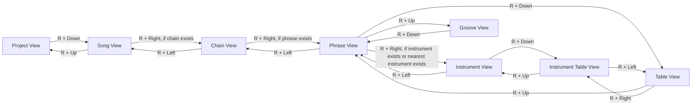

# RG Nano Input Map

This map is derived from the LGPT source, not from guessing at the UI.

The simulator must preserve LGPT's button-mask behavior. `AppWindow` keeps a live mask of held buttons and sends that mask to the active view on every button down/up event. That makes combos such as `R + Down`, `A + Left`, and `B + Start` part of the real control language.

## Physical Buttons

| RG Nano | Simulator key | Script name |
| --- | --- | --- |
| Up | `u` | `u` |
| Down | `d` | `d` |
| Left | `l` | `l` |
| Right | `r` | `r` |
| A | `a` | `a` |
| B | `b` | `b` |
| X | `x` | `x` |
| Y | `y` | `y` |
| L | `m` | `m` |
| R | `n` | `n` |
| Start | `s` | `s` |
| Select | `q` | `q` |

Use `down <key>`, `press <key>`, and `up <key>` in scripts to make held combos exact. For example, `R + Down` is:

```text
down n
press d 80
up n
```

## Global Field Editing

`FieldView` is the shared behavior for project and instrument fields:

| Input | Behavior |
| --- | --- |
| D-pad | Move field focus. |
| `A` | Activate focused field. |
| `A + D-pad` | Edit focused field by its normal step. |
| `B` | Secondary click on focused field. |
| `B + D-pad` | Edit focused field by its alternate step. |

## Boot Project Selector

Initial modal actions are `Load`, `New`, `Exit`.

| Input | Behavior |
| --- | --- |
| Left/Right | Select `Load`, `New`, or `Exit`. |
| Up/Down | Move through folders/projects. |
| `B + Up/Down` | Page through folders/projects. |
| `A` on `Load` | Load `lgpt...` project folders, or enter normal folders. |
| `A` on `New` | Open `NewProjectDialog`. |
| `A` on `Exit` | Exit boot modal. |
| `A + B` on a project | Delete project confirmation. |

## New Project Dialog

The dialog starts on the project-name row. The generated folder name is always prefixed with `lgpt_`.

| Input | Behavior |
| --- | --- |
| Left/Right on name row | Move character cursor. |
| Up/Down | Toggle between name row and button row. |
| Left/Right on button row | Select `Random`, `Ok`, or `Cancel`. |
| `A` on name row | Open on-screen keyboard. |
| `A` on `Random` | Generate an unused random name. |
| `A` on `Ok` | Create the project and return success. |
| `A` on `Cancel` | Cancel. |

In keyboard mode:

| Input | Behavior |
| --- | --- |
| D-pad | Move keyboard focus. |
| `A` | Insert focused character, backspace, or accept `OK`. |
| `B` | Backspace. |
| L/R | Move name cursor. |
| Start | Leave keyboard mode. |

## View Graph

These are the important source-defined view transitions.



## Song View

| Input | Behavior |
| --- | --- |
| D-pad | Move song cursor. |
| `A` | Paste last chain into empty slot, then repeated `A` can allocate a new chain. |
| `A + Left/Right` | Decrement/increment chain by 1. |
| `A + Up/Down` | Increment/decrement chain by 16. |
| `B + Up/Down` | Jump song offset by 16 rows. |
| `B + Left/Right` | Toggle sequencer live/song mode. |
| `B + A` | Cut current song position. |
| `B + L`, then `A + L` | Clone current chain. |
| `A + L` | Paste clipboard. |
| `B + R` | Toggle mute. |
| `A + R` | Toggle solo. |
| L + Up/Down | Jump song sections. |
| L + Left/Right | Nudge tempo. |
| Start | Start playback. |
| L + Start | Start current row. |
| R + Start | Stop playback. |

## Chain View

| Input | Behavior |
| --- | --- |
| D-pad | Move chain cursor. |
| `A` | Paste last phrase, and allocate new phrase when on phrase column. |
| `A + Left/Right` | Decrement/increment selected value by 1. |
| `A + Up/Down` | Increment/decrement selected value by 16 for phrase column, or 12 for transpose column. |
| `B + D-pad` | Warp between chains or rows. |
| `B + A` | Cut current chain position. |
| `B + L`, then `A + L` | Clone current phrase. |
| `A + L` | Paste clipboard. |
| `B + R` | Toggle mute. |
| `A + R` | Toggle solo. |
| Start | Start chain from current row. |
| R + Start | Start full chain. |

## Phrase View

| Input | Behavior |
| --- | --- |
| D-pad | Move phrase cursor. |
| `A` | Preview notes/instruments and paste last value. |
| `A + D-pad` | Edit note, instrument, command, or parameter value. |
| `A + Up/Down` on command columns | Open command selector. |
| `B + D-pad` | Warp to neighboring phrases or phrase rows in chain. |
| `B + A` | Cut current phrase position. |
| `B + L`, then `A + L` | Clone instrument or table reference when applicable. |
| `A + L` | Paste clipboard. |
| `B + R` | Toggle mute. |
| `A + R` | Toggle solo. |
| Start | Start phrase from current row. |
| R + Start | Start full phrase. |

## Instrument And Samples

The sample workflow starts in `InstrumentView` with focus on the `sample:` field for sample instruments.

| Input | Behavior |
| --- | --- |
| D-pad | Move field focus. |
| `A + D-pad` | Edit focused parameter. |
| `A` on `sample:` | Enter `VM_NEW`; next `A` opens sample import. |
| `B + Left/Right` | Move to previous/next instrument. |
| `B + Up/Down` | Move instrument by 16. |
| `B + A` on first sample field | Purge assigned sample. |
| `B + L`, then `A + L` | Clone focused table value when applicable. |
| R + Left | Return to Phrase. |
| R + Down | Open instrument table view. |
| Start | Start phrase from current row. |
| R + Start | Start full phrase. |

Sample import modal actions are `Listen`, `Import`, `Record`, `Exit`.

| Input | Behavior |
| --- | --- |
| Up/Down | Move through sample/folder list. |
| Left/Right | Select `Listen`, `Import`, `Record`, or `Exit`. |
| `A` on a folder | Enter folder. |
| `A` on `Listen` | Preview selected sample. |
| `A` on `Import` | Import selected sample and assign it to the current instrument. |
| `A` on `Record` | Open record dialog. Physical RG Nano has no microphone path, so uploaded samples are the realistic target. |
| `A` on `Exit` | Leave sample import. |
| `B + Up/Down` | Page through sample list. |
| Start + Up/Down | Browse samples while previewing. |
| Start + Right | Import selected sample. |
| Start + Left | Navigate up one folder when not at sample root. |

## Table And Groove

Table view follows the same tracker editing style:

| Input | Behavior |
| --- | --- |
| D-pad | Move table cursor. |
| `A + D-pad` | Edit table value. |
| `A + Up/Down` on command columns | Open command selector. |
| `B + D-pad` | Warp between tables. |
| `B + A` | Cut current position. |
| `B + L` | Select/extend selection. |
| R + Up | Return to Phrase or Instrument depending on table type. |
| R + Left/Right | Switch between phrase table and instrument table where applicable. |

Groove view:

| Input | Behavior |
| --- | --- |
| Up/Down | Move groove cursor. |
| `A` | Initialize value. |
| `A + Left/Right` | Adjust value by 1. |
| `A + Up/Down` | Adjust value with alternate mode. |
| `B + D-pad` | Warp groove. |
| `B + A` | Clear value. |
| R + Down | Return to Phrase. |

## Simulator Coverage Target

The simulator should not need hand-written one-off probes for every screen. The intended path is:

1. Keep the script runner faithful to held button masks.
2. Use this source-derived map to generate deterministic navigation routes.
3. Add assertions at the output boundaries: view marker pixels/screenshots, logs, imported files, saved project files, and audio callbacks.
4. Test on hardware only after the simulator route proves the workflow.

`tools\rgnano-sim-routes.ps1` is the first route-helper layer. Scripts can use `route from.to` commands such as `route project.to_song`, `route song.to_chain`, `route phrase.to_instrument`, and `route instrument.open_sample_import`; the runner expands them into the exact held-button events described above.
