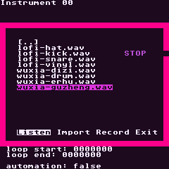
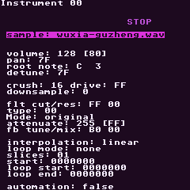
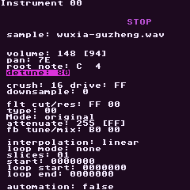
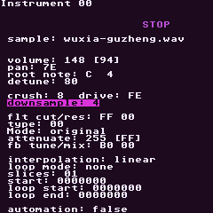
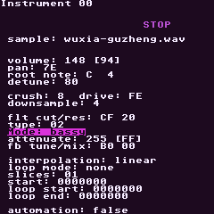
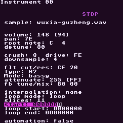

# Current Sample Workflow Audit

This audit uses `projects/resources/RGNANO_SIM/sample-workstation-exploration.rgsim`.

The run imported `wuxia-guzheng.wav` through the real Sample Import modal, edited instrument parameters with the Instrument View's normal `A + D-pad` field controls, and captured audio from phrase-context playback. The simulator confirmed:

- `wuxia-guzheng.wav` was copied into the active project's `samples` folder.
- instrument `00` was assigned to `wuxia-guzheng.wav`.
- edited playback produced audio capture larger than 4 KB.
- the run ended with a clean simulator log.

## RG Nano Flow Observed

### Pick A Sample

The sample import modal works, including list navigation and quick import. The weakness is visual: the screen is a text list plus text buttons. It does not show sample length, waveform shape, category, root note, or whether the sample is already in the project.

### Loaded Instrument

Once imported, the instrument becomes a long vertical parameter stack. The sample assignment is clear enough, but there is no visual grouping. Source, pitch, tone, filter, loop, and motion all compete equally.

### Pitch And Level Edits

Changing volume, pan, root note, and detune works through `A + D-pad`. The workflow is reliable but mentally indirect: the producer has to know which field matters and remember what each hex-ish value means.

### Grit Edits

Crush, drive, and downsample are strong sample-design controls. They should be a visual "texture" page with a clear grit meter, because they are fun sound-shaping tools currently hiding as plain rows.

### Filter Edits

Cutoff/resonance/type/mode already exist and can make a sample feel much more playable. The missing piece is a filter page: cutoff bar, resonance amount, mode label, and maybe a tiny curve.

### Loop And Slice Edits

Loop mode, slices, start, loop start, and loop end are the heart of sample manipulation, but this is the least visual part of the current UI. These controls need a waveform view with start/loop/end markers.

## Difference From M8 Flow

M8 splits the mental model more clearly:

- Instrument View: choose the engine and high-level sound parameters.
- Modulation View: assign movement sources to destinations.
- Instrument Pool: manage many instruments as a library.
- Sampler/Sample Editor: see and edit audio material visually.

RG Nano currently compresses most sample power into one Instrument View plus one Sample Import modal. That is compact, but it makes visual sample work hard.

The practical target is not to copy M8 screen-for-screen. The RG Nano should keep the shortcut-heavy tracker core, but expose sample design as small visual pages:

- Source: sample, preview/import, root note, detune, slices.
- Shape: volume, pan, crush, drive, downsample, interpolation.
- Filter: cutoff, resonance, type, mode, attenuation.
- Loop: start, loop start, loop end, loop mode, waveform markers.
- Motion: table automation and reusable movement templates.

## Next UI Prototype

Build a visual Source/Loop page first:

- sample name and import/preview state
- waveform overview from the assigned WAV
- start marker
- loop start/end markers
- loop mode glyph
- root note and detune
- quick low/mid/high audition gesture

This would directly address the biggest gap seen in the real workflow: the app can shape samples, but the producer cannot see the sample they are shaping.
