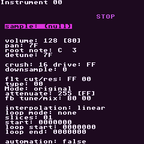
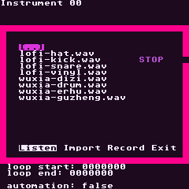
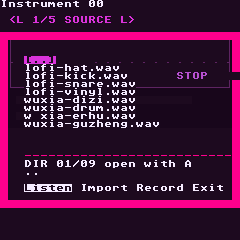
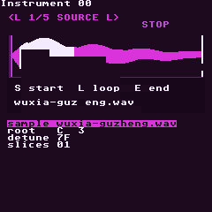
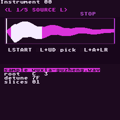
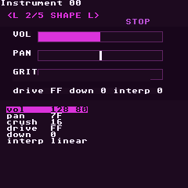
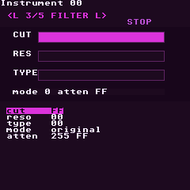
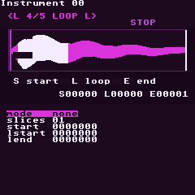
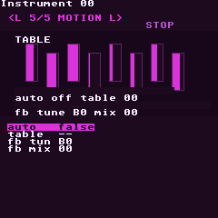

# RG Nano Sample Workstation Exploration

This branch explores a less text-heavy sample and instrument workflow for the RG Nano. The goal is not to remove tracker power; it is to make sample design feel like a small instrument surface instead of a long settings list.

## Baseline Screens

Current Instrument View:



Current Sample Import modal:



Updated Sample Import modal:



## Current Problem

The existing sample instrument is already powerful, but the interface hides that power in a dense text stack. Important controls compete for attention:

- sample source
- volume and pan
- root note and detune
- crush, drive, and downsample
- filter cutoff, resonance, type, mode, and attenuation
- feedback tune and mix
- interpolation
- loop mode, slices, start, loop start, and loop end
- automation and instrument table

That is too much for one 240x240 text menu. It is usable for someone who already knows LGPT, but it does not invite playful sound design.

## Implemented Prototype

This branch now replaces the single long sample-instrument list with five Instrument Lab pages. The controls are still the real LGPT sample instrument variables, but each page gets a visual panel sized for the RG Nano screen. Use `L + Left/Right` to switch pages.

### Source



Shows the loaded WAV as an actual waveform preview, plus start/loop/end markers and the core source fields.

### Marker Edit



On Source and Loop, use `L + Up/Down` to choose `START`, `LSTART`, or `END`, then use `L + A + Left/Right` to nudge the selected marker on the waveform.

### Shape



Groups level, pan, and grit controls so volume/pan/crush/drive/downsample feel like sound-shaping controls instead of isolated rows.

### Filter



Groups cutoff, resonance, filter type, mode, and attenuation into one tone page.

### Loop



Uses the same real waveform preview, focused on loop mode, slice count, start, loop start, and loop end.

### Motion



Puts table automation and feedback controls on a motion page. This is the roughest page visually because the current app has table selection, not a full modulation workstation yet.

## Design Direction

Keep shortcuts fast and memorizable. Use visuals for state, not paragraphs.

Instrument Lab pages:

| Page | Job | Visual Bias |
| --- | --- | --- |
| Source | Pick/import/preview sample, root note, detune, slices | sample name, pitch test, small waveform |
| Shape | Volume, pan, crush, drive, downsample, interpolation | meters, pan marker, grit meter |
| Filter | Cutoff, resonance, filter type/mode, attenuation | filter curve or cutoff bar |
| Loop | Start, loop start, loop end, loop mode, slices | waveform window with loop markers |
| Motion | Instrument table, automation, movement templates | step mini-grid and motion arrows |

## Button Philosophy

- `D-pad`: move focus inside the current page.
- `A + D-pad`: edit the focused value.
- `L + Left/Right`: switch Instrument Lab page.
- `L + Up/Down`: choose the active waveform marker on Source/Loop.
- `L + A + Left/Right`: nudge the active waveform marker.
- `R + A + Left/Up/Right`: audition the current sample low/root/high.
- `R + A + Down`: stop sample audition.
- `Start`: audition current instrument in phrase context.
- `R + Start`: audition in song context.
- `R + Left`: return to Phrase.
- `R + Down`: open instrument table/motion.

## First Build Target

The first prototype implements these Instrument Lab pages directly in `InstrumentView`. Use `L + Left/Right` to switch between Source, Shape, Filter, Loop, and Motion. It is still intentionally experimental, but it proves the visual-page direction inside the real app.

The Source/Loop direction matters most because sample-heavy production depends on quickly answering:

- What sample is loaded?
- What part of it plays?
- Is it one-shot, looped, ping-pong, oscillator, or loop-sync?
- What note is it tuned to?
- Does it still sound good when pitched low, normal, and high?

The direct audition shortcut is intentionally shoulder-heavy: hold `R + A`, then tap `Left`, `Up`, or `Right` to hear the current sample below root, at root, or above root without leaving Source, Shape, Filter, Loop, or Motion. Tap `R + A + Down` to stop. That gives the small device a sound-design loop that feels more like a dedicated workstation than a parameter list.

No synth engines yet. Make sample instruments feel great first.

## Current Limitations

- The Source and Loop waveform is read from the loaded sample buffer, so it reflects the actual WAV shape.
- Source/Loop marker edits now have waveform shortcuts, but there is not yet a dedicated trim/chop editor.
- Sample audition is live from the Instrument Lab, but crop/normalize/resample are still future editor actions.
- Motion is only a visual grouping for existing table/feedback settings; it is not an M8-style modulation matrix yet.
- Sample import now has a selected-item info strip, but it is still primarily a text list. A waveform-aware library/browser is a separate next step.

## Layout Audit

Tiny screens need automated layout checks, not just screenshots. The preferred check builds the simulator, captures the Instrument Lab pages, audits them, and cleans up generated files:

```powershell
python tools\run_sample_lab_layout_audit.py
```

To audit existing captures manually after running `projects/resources/RGNANO_SIM/sample-lab-pages-preview.rgsim`, run from `projects`:

```powershell
python ..\tools\rgnano_layout_audit.py .\sample-lab-source.bmp .\sample-lab-source-audition.bmp .\sample-lab-marker-edit.bmp .\sample-lab-shape.bmp .\sample-lab-filter.bmp .\sample-lab-loop.bmp .\sample-lab-motion.bmp
```

The audit fails on:

- screenshots that are not 240x240 app captures
- foreground pixels bleeding onto the app edge
- rows that are too dense to be readable
- Source/Loop waveforms colliding with legend or editable fields
- Shape/Filter/Motion controls pushing into the field list
